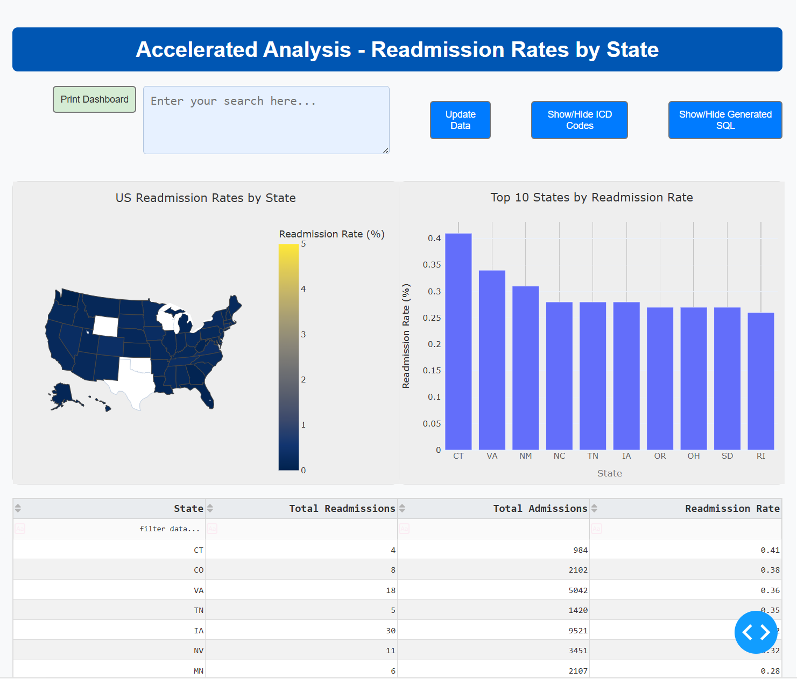
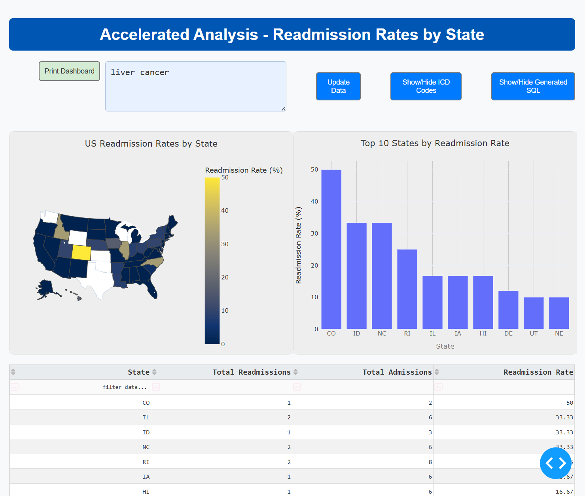

# Process Overview

This project takes in standardized healthcare claims data, processes it, calculates a simplified version of the hospital-wide readmission quality measure, and demonstrates displaying the output on a dashboard.

It consists of example source data from Medicare as well several Python scripts that are executed in a specific order to perform the analysis. Together, they show the automated process of extracting, loading, transforming, analyzing, and visualizing data.


## Technical Overview

The main script `main.py` runs the following scripts in order:

1. `create_claims_db.py`: Creates the initial database structure.
2. `state_data_import.py`: Imports state data into the database.
3. `gender_data_import.py`: Imports gender data into the database.
4. `claims_data_import.py`: Imports the claims data into the database.
5. `bene_data_import.py`: Imports beneficiary data into the database.
6. `icd_codes_import.py`: Imports ICD-9 to ICD-10 code crosswalk data and creates a mapped claims table.
7. `icd_description_import.py`: Imports ICD-10 codes with their descriptions.
8. `identify_readmissions.py`: Identifies readmission cases in the data.
9. `calc_readmission_rate.py`: Calculates the readmission rate based on the processed data.
10. `chart.py`: Creates a map and chart visualization using matplotlib.
11. `plotly_dashboard_ai.py`: Generates an interactive Plotly Dash dashboard with AI-powered natural language query capabilities.

## Setup Instructions

1. Ensure you have Python installed on your system (Python 3.6 or higher is recommended).

2. Create a new virtual environment:
   ```
   python -m venv claims_env
   ```

3. Activate the virtual environment:
   - On Windows:
     ```
     claims_env\Scripts\activate
     ```
   - On macOS and Linux:
     ```
     source claims_env/bin/activate
     ```

4. Install the required dependencies:
   ```
   pip install -r requirements.txt
   ```

5. For the AI-enhanced dashboard, set the following environment variables:
   - `LLM_API_URL`: URL for the LLM API endpoint
   - `LLM_API_KEY`: API key for authentication

   Note: These environment variables are normally configured for our CVP Franklin platform (https://hellofranklin.com/), but will also work with any OpenAI API compatible endpoint like OpenRouter, Google Gemini, or OpenAI itself.

## Running the Analysis

To run the entire analysis process, simply execute the main script:

```
python main.py
```

This will run all the scripts in the correct order and provide output for each step.

To run just the AI-enhanced dashboard:

```
python plotly_dashboard_ai.py
```

## Input Data

The analysis uses several data sources:

1. Inpatient claims data stored in CSV files in the `data/inpatient/` directory.
2. Beneficiary data stored in CSV files in the `data/bene/` directory.
3. State data stored in `data/state/state.csv`.
4. ICD code data in the `data/icd/` directory:
   - `gem_i9diag.txt`: ICD-9 to ICD-10 diagnosis code crosswalk
   - `icd10cm-codes-April-2025.txt`: ICD-10 codes with their descriptions

The inpatient claims files are verbatim copies downloaded from the first four samples available [here](https://www.cms.gov/data-research/statistics-trends-and-reports/medicare-claims-synthetic-public-use-files/cms-2008-2010-data-entrepreneurs-synthetic-public-use-file-de-synpuf/de10-sample-1) on CMS.gov.

## Database Structure

The project uses a DuckDB database. The database schema is defined in SQL files located in the `sql/` directory:

- `beneficiary_summary.sql`
- `gender.sql`
- `inpatient_claims.sql`
- `readmission_rate.sql`
- `state.sql`

The AI-enhanced dashboard also utilizes additional tables created by the ICD code import scripts:
- `icd_diag_xwalk`: Contains the crosswalk mapping between ICD-9 and ICD-10 diagnosis codes
- `INPATIENT_CLAIMS_ICD10`: Contains claims data with ICD-10 diagnosis codes (mapped from original ICD-9 codes)
- `ICD10_DIAG_DESC`: Contains ICD-10 codes and their descriptions for user-friendly display

## Visualization

The project includes two visualization components:

1. Static Visualizations (`chart.py`) suitable for use in a paper or presentation:
   - Generates a map visualization using matplotlib and shapefiles
   - Creates a column chart of top readmission rates
   - Outputs static PNG files for reporting

2. Interactive AI-Enhanced Dashboard (`plotly_dashboard_ai.py`):
   - Creates a Plotly Dash web application
   - Features interactive choropleth map and bar charts
   - Includes a data table with sorting and filtering capabilities
   - Print functionality for reports
   - Natural language query interface for filtering data by medical conditions
   - AI-powered translation of natural language to SQL queries
   - Dynamic ICD-10 code lookup based on user queries
   - Display of relevant ICD-10 codes and descriptions
   - Ability to view the generated SQL for transparency
   - Intelligent handling of broad or ambiguous queries

   **Dashboard Screenshots:**

   Initial dashboard view:
   

   Dashboard with AI filter applied:
   

## Result

The analysis will create and populate a DuckDB database file named `claims.duckdb` with the processed data and results. The script execution will provide detailed output for each step, including:

- Confirmation of database table creation
- Data import statistics
- Readmission identification results
- Calculated readmission rates for each year

The final output will show the readmission rates for the years 2008, 2009, and 2010, showing trends of hospital readmissions over this period.

With the AI-enhanced dashboard, users can further explore the data by asking natural language questions about specific medical conditions, such as "show me readmission rates for patients with heart failure" or "find readmissions related to diabetes complications." The system will automatically translate these queries into SQL, filter the data accordingly, and update the visualizations.

Note: for demonstration purposes, we applied many but not all of the rules for [hospital-wide readmission](https://qualitynet.cms.gov/files/66354839cc07c26dc848361e?filename=2024_HWR_AUS_Report_v1.0.pdf). For example, in the `identify_readmissions.py` file, we filter for:
* Overlapping claims that should be counted as one index stay
* Excluding rehabilitation and psychiatric stays 
* Excluding readmissions after the patient was coded as leaving against medical advice

## Notes

Due to the age of this data and the fact that it is still coded for ICD-9, we did *not* apply all of the latest rules as of 2025. Before using this framework for real purposes, you should ensure all parts of the relevant measure calculation method are applied.

The source data for this project is synthetic - it has many of the same properties as real claims, but has been de-identified and modified to make it no longer identifiable. Per CMS advice, you should not infer any statistical relationships from the underlying data.

Generally speaking, we have structured this project as a _learning experience_ and not as something suitable for running in a production environment. For example:

* all the data imports are separated in named files like `bene_data_import.py` and `claims_data_import.py` that are called directly. In a larger project, we would orchestrate them with a tool like Airflow or Prefect to track their progress.
* `plotly_dashboard_ai.py` has both presentation and business/calculation logic. Normally, we would separate those for modularity.
* we included the final .duckdb database and .png images generated by the process. Normally, one would generate these from the scripts to ensure the latest data is included.
